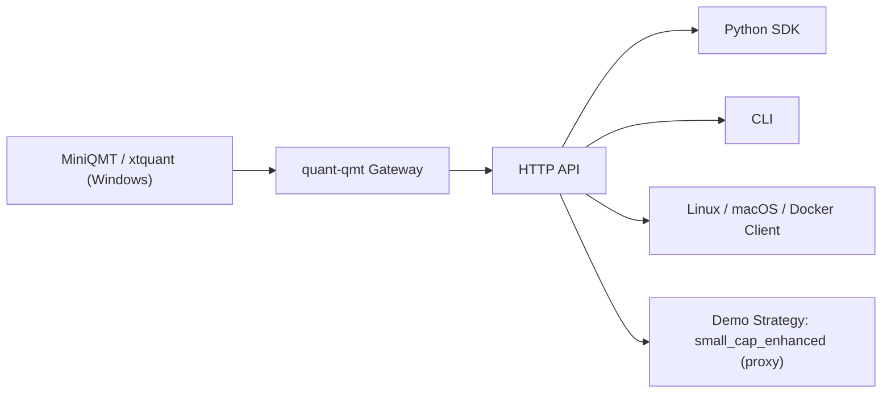

# 架构说明

## 1. 总体目标

`quant-qmt` 的设计目标很简单：

- Windows 侧只负责运行 MiniQMT 与 HTTP 网关
- 任意平台只通过 SDK / CLI / HTTP 访问 Windows 网关
- 不把 QMT、数据服务、回测引擎、数据库重新耦合在一起

## 2. 组件划分

### 2.1 `quant_qmt.gateway`

负责 Flask 网关与 xtquant 适配：

- `app.py`
  - Flask 应用初始化
  - CORS
  - 交易接口前的连接保护
- `state.py`
  - XTTrader 连接生命周期
  - 账户缓存与自动订阅
  - 回调 JSONL 持久化
  - 全推实时行情缓存
  - 价格类型映射
- `routes_*.py`
  - 健康检查
  - 数据接口
  - 交易接口
  - 查询接口
  - 账户订阅接口

### 2.2 `quant_qmt.sdk`

对 HTTP 网关做轻量封装：

- `QmtGatewayClient`
  - 保留原有接口风格
  - 自动处理 `code/message/data`
  - 用于 CLI、策略 demo、外部项目二次开发

### 2.3 `quant_qmt.strategy`

示例策略层：

- `small_cap_proxy.py`
  - `small_cap_enhanced` 的 QMT-only 代理版
  - 从 QMT 日线直接拉取 `close/volume/amount`
  - 用 `amount / liquidity` 做小市值代理打分
  - 输出计划单，支持可选模拟盘提交

### 2.4 `quant_qmt.cli`

统一命令入口：

- `doctor`
- `gateway start`
- `smoke`
- `data ...`
- `trade ...`
- `demo small-cap-enhanced`

## 3. 网关边界

### 3.1 为什么必须 Windows 隔离

MiniQMT 与 xtquant 本质上是 Windows 依赖链。  
所以本项目明确采用“Windows 网关隔离边界”：

- 网关在 Windows 跑
- Linux / macOS / Docker 不直接碰 MiniQMT
- 跨平台部分只通过 HTTP 请求访问 Windows 网关

### 3.2 为什么不引入数据库

本项目 V1 只做单体可部署工具链：

- 历史数据直接来自 xtdata
- 实时缓存存在内存
- 回调事件落 JSONL
- 示例策略直接在内存算分和出计划单

这样做的好处是：

- 部署最轻
- 依赖最少
- 排障路径最短

## 4. 关键可靠性设计

### 4.1 自动重连

- `health` 会在未连接时尝试重连
- `/api/v1/trader/reconnect` 提供显式重连接口
- 应用启动时连接失败也不会直接退出，保留后续重连空间

### 4.2 回调持久化

- 所有 XTTrader 回调先进入内存环形缓冲
- 如果设置了 `QMT_CALLBACK_LOG_FILE`，同时写入 JSONL
- 便于重启后排查成交、撤单、报错、连接状态

### 4.3 全推实时缓存

- 优先使用 `subscribe_whole_quote`
- 查询时如果缓存缺失，再尝试 `get_full_tick`
- 提供 `/api/v1/data/realtime/cache` 给策略和外部调用方直接读取

### 4.4 原生市价映射

`price_type=market` 不映射为伪市价 `LATEST_PRICE`，而是优先映射交易所原生 IOC / 剩撤类型：

- 上海 / 北交：`MARKET_SH_CONVERT_5_CANCEL`
- 深圳：`MARKET_SZ_CONVERT_5_CANCEL`

## 5. small_cap_enhanced 代理版架构

### 5.1 数据来源

- universe: `xtdata.get_stock_list_in_sector("沪深A股")`
- 行情: `/api/v1/data/kline_rows`
- 字段: `open/high/low/close/volume/amount`

### 5.2 代理口径

由于 QMT 原生日线链路不直接提供可靠的历史 `circ_mv` / `total_mv`：

- 使用 `amount` 的滚动均值作为规模代理
- 使用流动性、动量、波动率、流动性稳定性共同打分

### 5.3 输出

- 计划单 JSON
- 计划单 CSV / Parquet
- 可选模拟盘下单结果

## 6. 架构图

